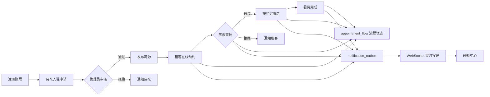

<h1 align="center">房屋租赁市场系统 | House Rental Market System</h1>

> 基于 Vue 3 + Spring Boot 3 + Spring Security + WebSocket 构建的北京房源租赁市场系统，完整覆盖“房东入驻审核 → 房源发布 → 租客预约 → 房东审批 → 实时通知”的业务闭环。

<br/>

<!-- 语言切换 -->
<p align="center">
  <a href="README.md">
    
  </a>

  <a href="README_EN.md">
    
  </a>
</p>

<br/>

<!-- 技术栈与 CI 状态 -->
<p align="center">
  
  
  
  
  
  
  
  
</p>

<p align="center">
  
</p>

<br/>

## 🚀 项目概览

北京房源市场：Spring Boot 3 + Vue 3 的租房信息与预约审批平台。房东发布房源，租客在线预约看房，房东在审批工作台完成审批，审批结果通过事务 Outbox 异步投递，全流程状态一致且可追溯。

系统已按真实互联网企业项目演进方式落地，核心链路为：

`房东入驻申请 → 管理员审核 → 发布房源 → 租客预约 → 房东审批 → 看房完成 → 通知中心`

- 租客：浏览北京各城区房源、搜索筛选、收藏、查看详情、提交预约、跟踪审批进度。
- 房东：提交入驻申请，管理员审核通过后发布房源，并在工作台批准、拒绝或完成预约。
- 管理员：审核房东入驻、管理用户、房源与预约，并查看全平台预约轨迹。
- 实时通知：预约状态变化通过事务 Outbox 异步投递，租客和房东可通过通知中心查看历史消息。

## 🛠️ 技术栈

### 后端

- **Spring Boot 3.2.4**：企业级 Java 应用框架
- **Java 21**：LTS 版本编程语言
- **MyBatis Plus 3.5.5**：ORM 与数据库操作增强
- **Spring Security 6 + JWT**：无状态认证与 RBAC 权限控制
- **Spring WebSocket + STOMP + SockJS**：实时通知通道
- **Spring Cache**：房源列表、详情与首页统计缓存，默认本地缓存，支持 Redis
- **MySQL 8.0**：核心业务数据存储，内置 `schema.sql` / `data.sql`
- **Redis 7**：可选 profile，切换 Redis 缓存与分布式限流
- **springdoc-openapi 2.3.0**：Swagger UI 在线接口文档
- **Lombok / Apache Commons**：开发效率与工具增强

### 前端

- **Vue 3.5 + Vite 8**：组合式 API 与现代构建工具
- **Pinia**：状态管理
- **Vue Router**：路由与角色权限守卫
- **Axios**：HTTP 请求与 JWT 拦截器
- **@stomp/stompjs + sockjs-client**：WebSocket 实时通信
- **Vue 组件体系**：房源卡片、预约表格、流程轨迹、通知中心、审批弹窗等

### 工程化

- **Docker Compose**：一条命令启动 MySQL 8 + Redis 7 演示环境
- **GitHub Actions CI**：后端测试（含 MySQL 服务）与前端构建自动执行
- **Maven Wrapper**：无需预装 Maven 也可构建
- **初始化数据**：北京各城区房源、演示用户、预约与通知历史一键复现

## ✨ 核心功能

### 用户认证与权限

- 登录 / 注册已移除验证码，改为固定窗口接口限流保护。
- BCrypt 密码加密，JWT 无状态令牌，支持 ADMIN / LANDLORD / TENANT 三种角色。
- 前端路由守卫 + 后端 `@PreAuthorize` 双重权限控制。
- 请求日志过滤与统一异常响应，未登录请求统一返回 401。

### 房东入驻审核

- 新增 `landlord_application` 入驻申请表，房东注册后默认进入待审核状态。
- 管理员在“房东审核”页通过或拒绝，并填写审核意见。
- 审核通过前，房东无法发布或修改房源。
- 审核结果写入事务 Outbox，并通过通知中心推送给房东。

### 房源管理

- 房东发布、编辑、上下架、删除房源，支持多图上传。
- 首页公开搜索：关键词、类型、城区、价格区间、面积区间分页查询。
- 房源详情自动累计 `views`，并与缓存联动刷新。
- 租客收藏 / 取消收藏 / 收藏状态检查。

### 预约审批闭环

- 租客提交预约申请，携带幂等键 `requestId`。
- 房东审批：批准 / 拒绝 / 完成看房；租客可取消预约。
- 预约表使用乐观锁 `version`，并发审批不会互相覆盖。
- 每次状态变化写入 `appointment_flow` 流程轨迹，双方可查看完整时间线。

### 通知中心与实时通信

- 预约创建、审批通过、拒绝、完成、取消均产生通知。
- 事务 Outbox 保证“业务状态变更”与“通知入队”处于同一事务。
- `NotificationOutboxProcessor` 定时投递 WebSocket 消息，失败自动重试。
- 租客端、房东端和管理端均有通知中心，可查看历史通知。

### 管理端

- 房东入驻审核：查看待审核申请、批准、拒绝并填写意见。
- 用户管理：查看、编辑、删除、重置密码。
- 房源管理：监控与管理全平台房源。
- 预约管理：查看所有预约状态与流程轨迹。

## 🔄 核心业务链路



## 🛡️ 可靠性设计

- **乐观锁**：`appointment.version` + MyBatis Plus `@Version` / 乐观锁拦截器，并发审批安全。
- **幂等提交**：`request_id` 唯一索引兜底，重复点击不会生成重复预约。
- **事务 Outbox**：状态变更与通知入队同事务；处理器按 `pending → processing → sent / failed` 推进，支持重试。
- **缓存策略**：房源列表、详情、首页统计使用 Spring Cache；默认内存缓存，`redis` profile 切换 Redis。
- **接口限流**：登录 / 注册固定窗口限流，默认 `InMemoryRateLimiter`，Redis 场景使用 `RedisRateLimiter`。
- **实时通信**：STOMP over WebSocket，SockJS 兜底，连接通道经过 JWT 鉴权。
- **数据可复现**：`schema.sql` 重建表结构，`data.sql` 写入北京房源、用户、预约、流程与通知演示数据。

## 📦 项目结构

```
SpringBoot-HouseMarket/
├── src/
│   ├── main/
│   │   ├── java/com/springboot/springboothousemarket/
│   │   │   ├── Config/           # 安全、WebSocket、缓存、MyBatis、异常处理等配置
│   │   │   ├── Controller/       # 认证、房源、预约、通知、管理端等 API
│   │   │   ├── Service/          # 业务逻辑、Outbox 处理器、限流实现
│   │   │   ├── Mapper/           # MyBatis Plus 数据访问
│   │   │   ├── Entity/           # 数据库实体
│   │   │   ├── dto/              # 请求 / 响应对象
│   │   │   └── Util/             # JWT 等工具类
│   │   └── resources/
│   │       ├── db/schema.sql     # 建库建表脚本
│   │       ├── db/data.sql       # 北京房源与演示数据
│   │       ├── mapper/           # MyBatis XML
│   │       ├── application.yml   # 默认配置
│   │       └── application-redis.yml # Redis profile
│   └── test/                     # 认证、预约、房东审核测试
├── frontend/
│   ├── src/
│   │   ├── api/                  # Axios 接口封装
│   │   ├── components/           # 房源卡片、审批表格、流程轨迹等组件
│   │   ├── composables/          # 认证、WebSocket、格式化等组合函数
│   │   ├── router/               # 路由与角色守卫
│   │   ├── stores/               # Pinia 状态
│   │   ├── views/                # 首页、登录、注册、租客、房东、管理、详情页
│   │   └── assets/styles/        # 全局样式
│   └── public/backgrounds/       # 首页、认证、租客、房东、管理端背景图
├── docs/INTERVIEW_TECH.md        # 面试技术选型与演进建议
├── uploads/                      # 房源图片
├── docker-compose.yml            # MySQL + Redis
├── .github/workflows/ci.yml      # GitHub Actions CI
├── pom.xml                       # Maven 配置
└── README.md
```

## 🔧 快速开始

仓库已包含初始化数据、房源图片和全部页面背景，克隆后按下面步骤即可看到与作者机器一致的效果。

### 1. 克隆项目

```bash
git clone https://github.com/AbsoluteZero001/HouseMarket.git
cd SpringBoot-HouseMarket
```

### 2. 启动 MySQL 与 Redis（可选）

```bash
docker compose up -d mysql redis
```

也可以使用本机已安装的 MySQL 8 和 Redis，只需保证默认端口和账号可访问。

### 3. 初始化数据库

```bash
# 使用本机 MySQL
mysql -uroot -p123456 < src/main/resources/db/schema.sql
mysql -uroot -p123456 < src/main/resources/db/data.sql
```

如果使用 Docker MySQL：

```bash
docker compose exec -T mysql mysql -uroot -p123456 < src/main/resources/db/schema.sql
docker compose exec -T mysql mysql -uroot -p123456 < src/main/resources/db/data.sql
```

`schema.sql` 会重建 `housemarket` 库，包含用户、房源、预约、流程轨迹、Outbox、房东入驻申请和收藏表；`data.sql` 写入北京各城区房源、用户、预约和通知历史。数据库连接配置在 `src/main/resources/application.yml`，如需修改密码请同步调整。

### 4. 启动后端

```bash
mvn spring-boot:run
```

或者使用 Maven Wrapper：

```bash
./mvnw spring-boot:run
```

默认端口 `8082`，Swagger 地址：http://localhost:8082/swagger-ui.html

### 5. 启动前端

```bash
cd frontend
npm install
npm run dev
```

默认端口 `5173`：http://localhost:5173

Vite 已配置 `/api`、`/uploads`、`/ws`、`/user` 代理到后端 `8082`，前端无需额外跨域配置。

### 6. 可选：启用 Redis profile

```bash
docker compose up -d redis
mvn spring-boot:run -Dspring-boot.run.profiles=redis
```

不启用 Redis 也能完整运行，默认使用内存缓存和单机限流。

## 👤 演示账号

| 角色 | 用户名 | 密码 |
| --- | --- | --- |
| 管理员 | `admin` | `admin123` |
| 房东 | `landlord1` | `123456` |
| 租客 | `tenant1` | `123456` |

## 📊 API 概览

| 模块 | 接口 |
| --- | --- |
| 认证 | `POST /api/v1/auth/register`、`POST /api/v1/auth/login` |
| 首页公开 | `GET /api/public/houses`、`GET /api/public/stats` |
| 房源 | `GET /api/houses`、`GET /api/houses/{id}`、`POST /api/houses/add`、`PUT /api/houses/{id}`、`DELETE /api/houses/{id}`、`GET /api/houses/my`、`POST /api/houses/upload-image` |
| 收藏 | `POST /api/favorites`、`DELETE /api/favorites/{houseId}`、`GET /api/favorites`、`GET /api/favorites/check` |
| 预约 | `POST /api/appointments`、`GET /api/appointments`、`PUT /api/appointments/{id}/approve`、`PUT /api/appointments/{id}/reject`、`PUT /api/appointments/{id}/cancel`、`PUT /api/appointments/{id}/complete`、`GET /api/appointments/{id}/flow` |
| 房东入驻 | `GET /api/landlord/application`、`GET /api/admin/landlord-applications`、`PUT /api/admin/landlord-applications/{id}/approve`、`PUT /api/admin/landlord-applications/{id}/reject` |
| 通知 | `GET /api/notifications` |
| 用户管理 | `GET /user`、`GET /user/current`、`PUT /user/{id}`、`DELETE /user/{id}`、`PUT /user/{id}/password` |

完整接口文档可通过 Swagger UI 在线访问和测试。

## 🗄️ 数据库设计

| 表 | 说明 |
| --- | --- |
| `sysuser` | 用户表：管理员、房东、租客，BCrypt 密码，逻辑删除 |
| `landlord_application` | 房东入驻申请表：pending / approved / rejected |
| `house` | 房源表：价格、面积、城区、图片、浏览数、上下架状态 |
| `appointment` | 预约表：乐观锁 `version`、幂等键 `request_id`、状态机 |
| `appointment_flow` | 预约流程轨迹：PUBLISH / BOOK / APPROVE / REJECT / COMPLETE / NOTIFY |
| `notification_outbox` | 事务 Outbox：pending / processing / sent / failed |
| `favorites` | 收藏表：用户与房源唯一约束 |

## 🧪 测试与 CI

```bash
mvn test
```

```bash
cd frontend
npm run build
```

GitHub Actions 在 `main` / `master` 推送和 Pull Request 时自动执行：

- 后端：启动 MySQL 服务，执行 `schema.sql` / `data.sql`，运行 `mvn test`。
- 前端：安装依赖并执行 `npm run build`。

## 🎨 资源与复现

- 房源图片：`uploads/` 已提交到 Git，数据库中的 `/uploads/*.png` 路径可直接访问。
- 页面背景：`frontend/public/backgrounds/` 已提交，覆盖首页、登录 / 注册、租客端、房东端和管理端。
- 背景再生成：运行 `python frontend/scripts/generate-backgrounds.py`（需要 Pillow）可重新生成海报级背景。
- 初始化数据：`src/main/resources/db/schema.sql` 与 `src/main/resources/db/data.sql`。

## 📚 面试与技术演进

项目的技术亮点、Redis / 分布式锁 / 悲观锁取舍，以及从 Outbox 演进到消息队列、从单机限流演进到 Redis 限流的完整思路，请参考 [docs/INTERVIEW_TECH.md](docs/INTERVIEW_TECH.md)。

## 🤝 贡献指南

欢迎提交 Issue 和 Pull Request。

1. Fork 本仓库
2. 创建特性分支（`git checkout -b feature/AmazingFeature`）
3. 提交更改（`git commit -m 'Add some AmazingFeature'`）
4. 推送到分支（`git push origin feature/AmazingFeature`）
5. 开启 Pull Request

---

项目持续完善中，欢迎关注和参与。
