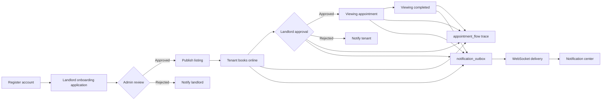

<h1 align="center">House Rental Market System | 房屋租赁市场系统</h1>

> A Beijing house rental market platform built with Vue 3 + Spring Boot 3 + Spring Security + WebSocket, covering the full business loop of "landlord onboarding review → listing publication → tenant booking → landlord approval → real-time notification".

<br/>

<!-- Language Switch Buttons -->
<p align="center">
  <a href="README.md">
    
  </a>

  <a href="README_EN.md">
    
  </a>
</p>

<br/>

<!-- Tech Stack and CI Status -->
<p align="center">
  
  
  
  
  
  
  
  
</p>

<p align="center">
  
</p>

<br/>

## 🚀 Project Overview

This is a Beijing house rental market built with Spring Boot 3 + Vue 3. Landlords publish listings, tenants book viewing appointments online, landlords approve appointments in the review workspace, and results are delivered asynchronously through a transactional outbox with consistent, traceable state.

The system follows the evolution path of a real internet company project. The core business flow is:

`Landlord onboarding application → Admin review → Publish listing → Tenant booking → Landlord approval → Viewing completed → Notification center`

- Tenants: browse Beijing listings across districts, search and filter, favorite, view details, submit appointments, and track approval progress.
- Landlords: submit an onboarding application, publish listings after admin approval, and approve, reject, or complete appointments in the workspace.
- Admins: review landlord onboarding applications and manage users, listings, and appointments across the platform.
- Real-time notifications: appointment status changes are delivered through a transactional outbox, and both tenants and landlords can view notification history.

## 🛠️ Technology Stack

### Backend

- **Spring Boot 3.2.4**: enterprise Java application framework
- **Java 21**: LTS programming language
- **MyBatis Plus 3.5.5**: ORM and enhanced database operations
- **Spring Security 6 + JWT**: stateless authentication and RBAC authorization
- **Spring WebSocket + STOMP + SockJS**: real-time notification channel
- **Spring Cache**: caching for listing lists, listing details, and home statistics; local cache by default with Redis support
- **MySQL 8.0**: core business storage, with built-in `schema.sql` / `data.sql`
- **Redis 7**: optional profile for Redis cache and distributed rate limiting
- **springdoc-openapi 2.3.0**: Swagger UI online API documentation
- **Lombok / Apache Commons**: development efficiency and utility support

### Frontend

- **Vue 3.5 + Vite 8**: Composition API and modern build tooling
- **Pinia**: state management
- **Vue Router**: routing and role-based guards
- **Axios**: HTTP requests with JWT interceptors
- **@stomp/stompjs + sockjs-client**: WebSocket real-time communication
- **Vue component system**: house cards, appointment tables, flow traces, notification center, review modals, and more

### Engineering

- **Docker Compose**: start MySQL 8 + Redis 7 demo environments with one command
- **GitHub Actions CI**: backend tests (with MySQL service) and frontend build
- **Maven Wrapper**: build without a pre-installed Maven
- **Seed data**: Beijing district listings, demo users, appointments, and notification history for reproducible results

## ✨ Core Features

### Authentication & Authorization

- CAPTCHA was removed from login / registration and replaced with fixed-window API rate limiting.
- BCrypt password encryption, JWT stateless tokens, and ADMIN / LANDLORD / TENANT roles.
- Dual permission control with frontend route guards and backend `@PreAuthorize`.
- Request logging filter and unified exception response; unauthenticated requests return 401.

### Landlord Onboarding Review

- A `landlord_application` table tracks onboarding applications; new landlords default to pending status.
- Admins approve or reject applications on the "Landlord Review" page with review notes.
- Landlords cannot publish or modify listings before approval.
- Review results are written to the transactional outbox and delivered to the landlord notification center.

### Listing Management

- Landlords publish, edit, take offline, and delete listings with multi-image upload.
- Public home search: keyword, type, district, price range, and area range with pagination.
- Listing detail automatically increments `views`, synchronized with the cache.
- Tenants can favorite, unfavorite, and check favorite status.

### Appointment Approval Loop

- Tenants submit appointment requests with an idempotency key `requestId`.
- Landlords approve, reject, or complete appointments; tenants can cancel appointments.
- The appointment table uses an optimistic lock `version`, preventing concurrent approvals from overwriting each other.
- Every status change is recorded in `appointment_flow`, giving both sides a complete timeline.

### Notification Center & Real-time Communication

- Notifications are generated for appointment creation, approval, rejection, completion, and cancellation.
- The transactional outbox keeps "business status change" and "notification enqueue" in the same transaction.
- `NotificationOutboxProcessor` periodically delivers WebSocket messages and retries on failure.
- Tenant, landlord, and admin views include a notification center with history.

### Admin Console

- Landlord onboarding review: inspect pending applications, approve, reject, and write review notes.
- User management: view, edit, delete, and reset passwords.
- Listing management: monitor and manage all platform listings.
- Appointment management: view all appointment statuses and flow traces.

## 🔄 Core Business Flow



## 🛡️ Reliability Design

- **Optimistic locking**: `appointment.version` with MyBatis Plus `@Version` and optimistic lock interceptor for safe concurrent approvals.
- **Idempotent submission**: `request_id` unique index prevents duplicate appointments from repeated clicks.
- **Transactional outbox**: status changes and notification enqueue share one transaction; the processor advances `pending → processing → sent / failed` with retries.
- **Cache strategy**: listing lists, details, and home statistics use Spring Cache; local cache by default, switchable to Redis with the `redis` profile.
- **Rate limiting**: fixed-window limits for login / registration; `InMemoryRateLimiter` by default and `RedisRateLimiter` for Redis.
- **Real-time communication**: STOMP over WebSocket with SockJS fallback and JWT-authenticated channels.
- **Reproducible data**: `schema.sql` recreates the schema and `data.sql` seeds Beijing listings, users, appointments, flows, and notifications.

## 📦 Project Structure

```
SpringBoot-HouseMarket/
├── src/
│   ├── main/
│   │   ├── java/com/springboot/springboothousemarket/
│   │   │   ├── Config/           # Security, WebSocket, cache, MyBatis, exception handling
│   │   │   ├── Controller/       # Auth, listing, appointment, notification, admin APIs
│   │   │   ├── Service/          # Business logic, outbox processor, rate limiters
│   │   │   ├── Mapper/           # MyBatis Plus data access
│   │   │   ├── Entity/           # Database entities
│   │   │   ├── dto/              # Request / response objects
│   │   │   └── Util/             # JWT and other utilities
│   │   └── resources/
│   │       ├── db/schema.sql     # Database schema
│   │       ├── db/data.sql       # Beijing listings and demo data
│   │       ├── mapper/           # MyBatis XML
│   │       ├── application.yml   # Default configuration
│   │       └── application-redis.yml # Redis profile
│   └── test/                     # Auth, appointment, landlord review tests
├── frontend/
│   ├── src/
│   │   ├── api/                  # Axios API wrappers
│   │   ├── components/           # House cards, approval tables, flow traces, etc.
│   │   ├── composables/          # Auth, WebSocket, formatting composables
│   │   ├── router/               # Routes and role guards
│   │   ├── stores/               # Pinia stores
│   │   ├── views/                # Home, login, register, tenant, landlord, admin, detail
│   │   └── assets/styles/        # Global styles
│   └── public/backgrounds/       # Home, auth, tenant, landlord, admin backgrounds
├── docs/INTERVIEW_TECH.md        # Interview tech selection and evolution notes
├── uploads/                      # Listing images
├── docker-compose.yml            # MySQL + Redis
├── .github/workflows/ci.yml      # GitHub Actions CI
├── pom.xml                       # Maven configuration
└── README.md
```

## 🔧 Quick Start

The repository already contains seed data, listing images, and all page backgrounds. After cloning, follow the steps below to reproduce the same experience as the author's machine.

### 1. Clone the Repository

```bash
git clone https://github.com/AbsoluteZero001/HouseMarket.git
cd SpringBoot-HouseMarket
```

### 2. Start MySQL and Redis (Optional)

```bash
docker compose up -d mysql redis
```

You can also use a local MySQL 8 and Redis installation as long as the default ports and credentials are accessible.

### 3. Initialize the Database

```bash
# With a local MySQL
mysql -uroot -p123456 < src/main/resources/db/schema.sql
mysql -uroot -p123456 < src/main/resources/db/data.sql
```

With Docker MySQL:

```bash
docker compose exec -T mysql mysql -uroot -p123456 < src/main/resources/db/schema.sql
docker compose exec -T mysql mysql -uroot -p123456 < src/main/resources/db/data.sql
```

`schema.sql` recreates the `housemarket` database with users, listings, appointments, flow traces, outbox, landlord applications, and favorites. `data.sql` seeds Beijing listings, users, appointments, and notification history. Database connection settings are in `src/main/resources/application.yml`; update them if you change the password.

### 4. Start the Backend

```bash
mvn spring-boot:run
```

Or with Maven Wrapper:

```bash
./mvnw spring-boot:run
```

Default port `8082`, Swagger UI: http://localhost:8082/swagger-ui.html

### 5. Start the Frontend

```bash
cd frontend
npm install
npm run dev
```

Default port `5173`: http://localhost:5173

Vite proxies `/api`, `/uploads`, `/ws`, and `/user` to the backend on `8082`, so no extra CORS configuration is needed.

### 6. Optional: Enable the Redis Profile

```bash
docker compose up -d redis
mvn spring-boot:run -Dspring-boot.run.profiles=redis
```

The application runs fully without Redis, using in-memory cache and single-instance rate limiting.

## 🐳 Docker One-Click Deployment

The project includes a complete Docker deployment setup:

- `Dockerfile`: multi-stage Maven build for the backend, running a Java 21 image.
- `frontend/Dockerfile`: Node build for the frontend with Nginx static hosting.
- `frontend/nginx.conf`: proxies `/api`, `/uploads`, `/ws`, and `/user`, including WebSocket support.
- `docker-compose.yml`: orchestrates MySQL, Redis, backend, and frontend services, and runs `00-schema.sql` → `01-data.sql` automatically.
- `一键启动.bat`: checks Docker, builds images, starts services, waits for readiness, and opens the browser on Windows.

Start with:

```bash
一键启动.bat
```

Or the equivalent command:

```bash
docker compose up -d --build
```

On first startup, the database is created and Beijing seed data is loaded automatically. If an existing database volume is detected, the script asks whether to reset and re-initialize it.

Default ports:

| Service | Address |
| --- | --- |
| Frontend | http://localhost:5173 |
| Backend | http://localhost:8082 |
| Swagger | http://localhost:8082/swagger-ui/index.html |
| MySQL | `localhost:3308` (container internal `3306`) |
| Redis | `localhost:6380` (container internal `6379`) |

To change ports or passwords, copy `.env.example` to `.env` and adjust the values, or override them in `docker-compose.yml`.

## 👤 Demo Accounts

| Role | Username | Password |
| --- | --- | --- |
| Admin | `admin` | `admin123` |
| Landlord | `landlord1` | `123456` |
| Tenant | `tenant1` | `123456` |

## 📊 API Overview

| Module | Endpoints |
| --- | --- |
| Auth | `POST /api/v1/auth/register`, `POST /api/v1/auth/login` |
| Public home | `GET /api/public/houses`, `GET /api/public/stats` |
| Listings | `GET /api/houses`, `GET /api/houses/{id}`, `POST /api/houses/add`, `PUT /api/houses/{id}`, `DELETE /api/houses/{id}`, `GET /api/houses/my`, `POST /api/houses/upload-image` |
| Favorites | `POST /api/favorites`, `DELETE /api/favorites/{houseId}`, `GET /api/favorites`, `GET /api/favorites/check` |
| Appointments | `POST /api/appointments`, `GET /api/appointments`, `PUT /api/appointments/{id}/approve`, `PUT /api/appointments/{id}/reject`, `PUT /api/appointments/{id}/cancel`, `PUT /api/appointments/{id}/complete`, `GET /api/appointments/{id}/flow` |
| Landlord onboarding | `GET /api/landlord/application`, `GET /api/admin/landlord-applications`, `PUT /api/admin/landlord-applications/{id}/approve`, `PUT /api/admin/landlord-applications/{id}/reject` |
| Notifications | `GET /api/notifications` |
| User management | `GET /user`, `GET /user/current`, `PUT /user/{id}`, `DELETE /user/{id}`, `PUT /user/{id}/password` |

The complete API documentation is available through Swagger UI.

## 🗄️ Database Design

| Table | Purpose |
| --- | --- |
| `sysuser` | Users: admin, landlord, tenant, BCrypt password, logical delete |
| `landlord_application` | Landlord onboarding: pending / approved / rejected |
| `house` | Listings: price, area, district, images, views, online / offline status |
| `appointment` | Appointments: optimistic lock `version`, idempotency key `request_id`, state machine |
| `appointment_flow` | Appointment traces: PUBLISH / BOOK / APPROVE / REJECT / COMPLETE / NOTIFY |
| `notification_outbox` | Transactional outbox: pending / processing / sent / failed |
| `favorites` | Favorites with a unique user-listing constraint |

## 🧪 Testing & CI

```bash
mvn test
```

```bash
cd frontend
npm run build
```

GitHub Actions runs automatically on `main` / `master` pushes and Pull Requests:

- Backend: starts a MySQL service, executes `schema.sql` / `data.sql`, and runs `mvn test`.
- Frontend: installs dependencies and runs `npm run build`.

## 🎨 Assets & Reproducibility

- Listing images: the `uploads/` directory is committed to Git, and `/uploads/*.png` paths in the database are directly accessible.
- Page backgrounds: `frontend/public/backgrounds/` is committed and covers home, login / register, tenant, landlord, and admin views.
- Regenerate backgrounds: run `python frontend/scripts/generate-backgrounds.py` (requires Pillow) to regenerate poster-level backgrounds.
- Seed data: `src/main/resources/db/schema.sql` and `src/main/resources/db/data.sql`.

## 📚 Interview Notes & Evolution

For the technical highlights, the trade-offs among Redis, distributed locks, and pessimistic locks, and the evolution from outbox polling to a message queue and from single-instance limiting to Redis limiting, see [docs/INTERVIEW_TECH.md](docs/INTERVIEW_TECH.md).

## 🤝 Contribution Guide

Issues and Pull Requests are welcome.

1. Fork this repository
2. Create a feature branch (`git checkout -b feature/AmazingFeature`)
3. Commit your changes (`git commit -m 'Add some AmazingFeature'`)
4. Push to the branch (`git push origin feature/AmazingFeature`)
5. Open a Pull Request

---

The project is continuously being improved. Stay tuned and get involved.
